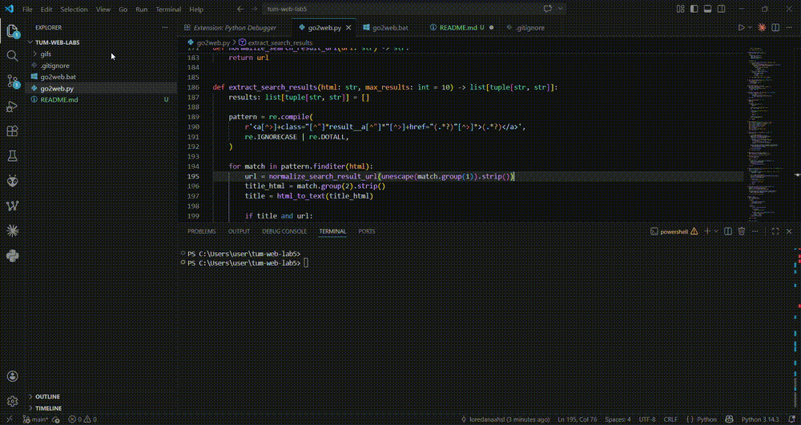
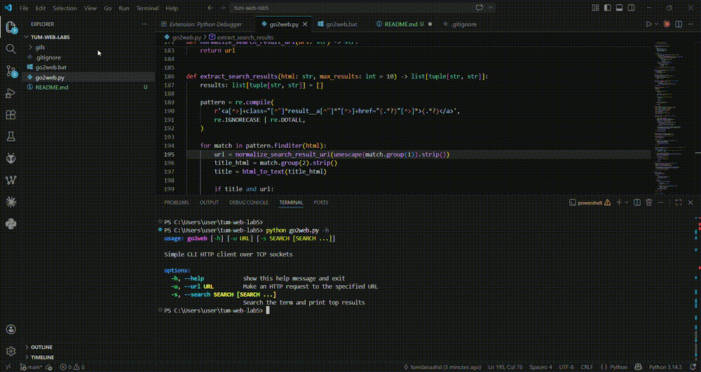
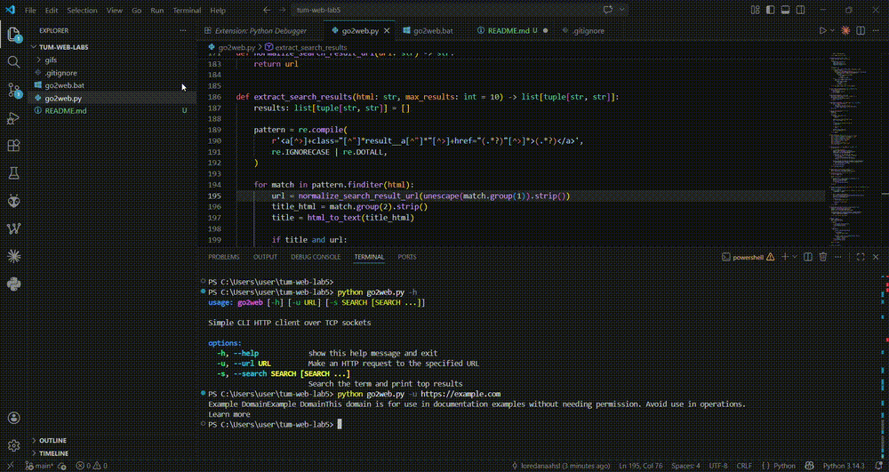

# go2web

A command-line HTTP client implemented over TCP sockets.

## Overview

This project implements a simple command-line web client for the university laboratory **Lab 5 - HTTP over TCP Sockets**.

The application supports:
- fetching a URL with `-u`
- searching the web with `-s`
- showing help with `-h`

The program does not use built-in or third-party HTTP client libraries for making HTTP or HTTPS requests.
Instead, it uses raw TCP sockets and SSL wrapping for HTTPS.

## Features

- `-h` show help
- `-u <URL>` make an HTTP request to the specified URL and print a human-readable response
- `-s <search-term>` search the web and print the top 10 results
- handles HTTP redirects
- handles chunked HTTP responses
- converts HTML content into readable text
- extracts real result URLs from search engine results
- includes a Windows launcher script

## Project Structure

```text
tum-web-lab5/
├── go2web.py
├── go2web.bat
├── README.md
├── .gitignore
└── gifs/
    ├── help.gif
    ├── fetch.gif
    └── search.gif
```

## Requirements

- Python 3
- Windows PowerShell or Command Prompt

## Usage

### Show help

```powershell
python go2web.py -h
```

or

```powershell
cmd /c go2web.bat -h
```

### Fetch a URL

```powershell
python go2web.py -u https://example.com
```

or

```powershell
cmd /c go2web.bat -u https://example.com
```

### Search the web

```powershell
python go2web.py -s tcp sockets
```

or

```powershell
cmd /c go2web.bat -s tcp sockets
```

## Example Output

### Help

```text
usage: go2web [-h] [-u URL] [-s SEARCH [SEARCH ...]]

Simple CLI HTTP client over TCP sockets

options:
  -h, --help            show this help message and exit
  -u, --url URL         Make an HTTP request to the specified URL
  -s, --search SEARCH [SEARCH ...]
                        Search the term and print top results
```

### URL fetch

```text
Example Domain
This domain is for use in documentation examples without needing permission.
Avoid use in operations.
Learn more
```

### Search

```text
1. Network socket - Wikipedia
   https://en.wikipedia.org/wiki/Network_socket
2. Understanding TCP Socket With Examples - howtouselinux
   https://www.howtouselinux.com/post/tcp-socket
3. Socket in Computer Network - GeeksforGeeks
   https://www.geeksforgeeks.org/computer-networks/socket-in-computer-network/
```

## Demo

### Help


### URL fetch


### Search


## Implementation Details

The application is implemented in Python and uses:
- `socket` for TCP communication
- `ssl` for HTTPS support
- `argparse` for CLI parsing
- `re` and `html` utilities for converting HTML to readable text
- `urllib.parse` for URL parsing and search query handling

The program manually:
- opens a TCP connection
- sends an HTTP GET request
- receives the raw HTTP response
- separates headers from body
- handles redirects
- decodes chunked responses
- converts HTML into readable terminal output

## Notes

This project was developed for the laboratory assignment **Lab 5 - HTTP over TCP Sockets**.

The implementation avoids using libraries such as:
- `requests`
- `httpx`
- other HTTP client abstractions

## How to Run

```powershell
python go2web.py -h
python go2web.py -u https://example.com
python go2web.py -s tcp sockets
```
